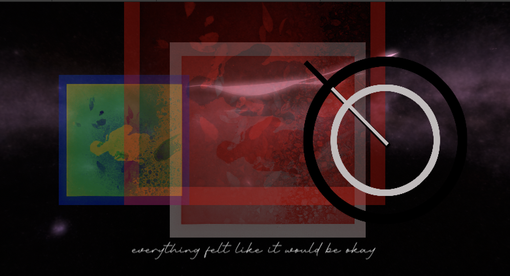
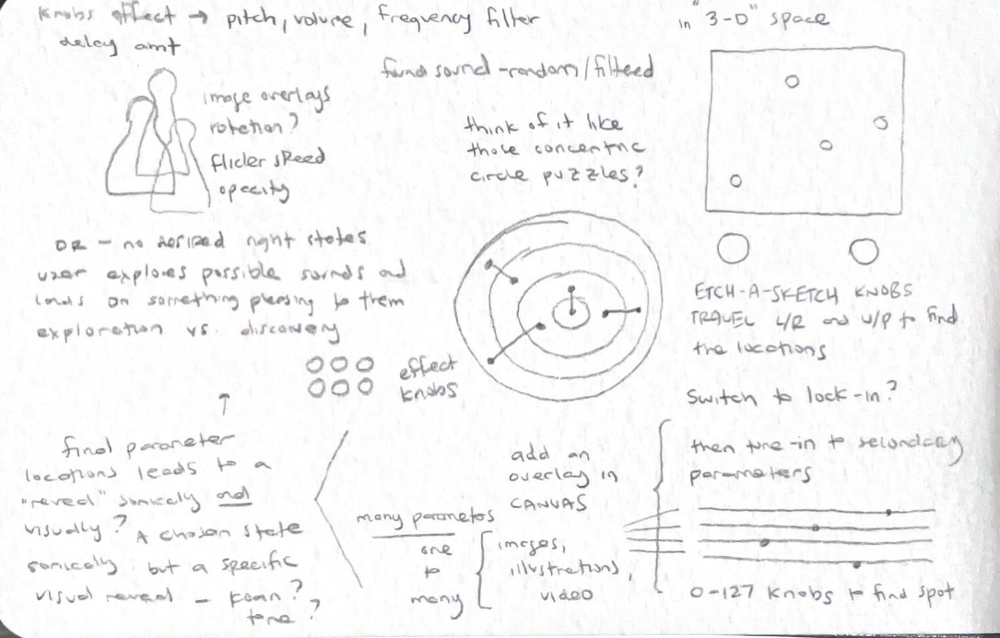
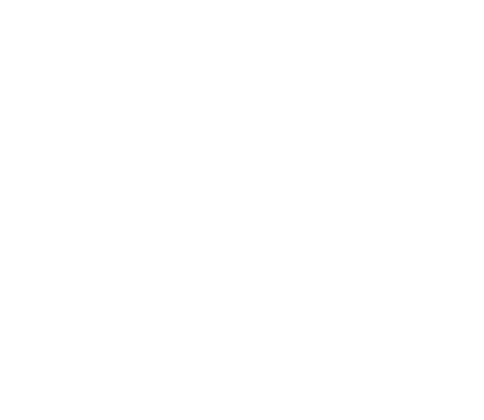

0# Lest Ten Horizons Cry | Process Documentation!

## Context Statement | 09.01.23

The initial idea here is alt-control audio-based game-like interaction. Specifically, *what would a game controlled with a synthesizer look like?* 

The audio-component of this could be either
- an actual modular synthesizer that is used to control a visual element, or
- a simulated synth-like interface that controls computer-based sound and visuals

Either could be a good direction, but currently I am leaning toward a simulated synth because it would have a lower barrier of entry for players (i.e simpler control scheme) and could be designed for a cool physical visual aesthetic (a la [lovehulton](https://www.lovehulten.com/)) As far as the "game" element, interface-only is always a favorite here as is  "environmental"-sim (can we consider a [pizza pie](https://github.com/mouseandthebillionaire/purrrfectPizza) an environment? I think so) but both that and the audio/physical aspects will shake out in the ideation phase.

Obviously this builds on previous work (especially [nY-Station](http://www.mouseandthebillionare.com/nys) and even ends up being a somewhat reverse [Furniture Music](https://github.com/Whaaat-Lab/furnitureMusic), but as I think about this are some strong precedents that are doing a lot of things that I'd like to borrow from. Specific detail on each in the [precedents](precedents.md) section, but calling out here some initial thoughts:  [lovehulton](https://www.lovehulten.com/) for physical interface (as mentioned above), [In Other Waters](https://www.fellowtraveller.games/in-other-waters) for screen-based interface, and both [Elektroplankton](https://www.nintendo.com/consumer/gameslist/manuals/DS_Electroplankton.pdf) and [Mu Cartographer](https://titouanm.com/mucartographer/) as more direct references (I'm leaning on Mu Cartographer a lot here in this early conception)

That's where we stand now!

Next Steps:
- Ideation
- [Precedent Study!](Precedents.md)

PS - *Lest Ten Horizons Cry* - is just anagram of "Synthesizer Controller"

Too many secrets!

Let's go!

## Ideation | 09.08.23

While the basic idea is “game controlled by synthesizer” there are a few design values that I would like to establish right off the bat
- elegant simplicity - in the physical object, visual representation, and music
- discoverable states instead of one "right" state
- reflective ambiguity

So, with that in mind, I went into the ideation phase, thinking through what this might look like. The first thing to hash out was (as mentioned above) is it going to be an actual synthesizer that control a visual simulation or  a simulated synth-like interface that controls computer-based sound and visuals (a la [nY-Station](Precedents.md/##nyStation)) I think the most interest direction for me is the latter. With that approach I will be able to build an aesthetically pleasing physical object that isn't to daunting for the player, and I will have tighter control over the sounds being made. It's *slightly* more work on the audio end, but I think it's worth it.

My second major idea hurdle here is what will the visuals look like. I really want this to be a robust simulation-type thing (as mentioned when discussing the precedent of [Nicky Case's Emoji Simulator(Precedents.md/##Nicky Case's Emoji Simulator)]), but while ideating it becomes clear that there is just too much complexity to deal with here. Also, it somewhat goes against the design value of simplicity, which is important.

I think the [Shadowmatic](Precedents.md/##Shadowmatic) reference is informative here. As mentioned in the precedents study, the real takeaway is I want to avoid this idea of "right" and "wrong" states (especially when it comes to audio). The sounds should be pleasing no matter what the user has done, but there should still be some sort of ideal "state." The solution for [Tikatmos](Precedents.md##Tikatmos), where the system randomly chose values that the user is trying to locate, is a good place to start. However, there should be some slight increase in complexity and beauty. "A better implementation of the TIKATMOS tuner minigame" still stands. 

So, the idea is this at this moment: 
- a physical handmade synth controller with some number of control inputs (to be ideated and refined later)
- audio is manipulated in pleasing ways as those control inputs are manipulated
- a visual element (separate screen? embedded screen? faked LoveHulten-style visualizer thing?) is updated along with the music. Each knob controls an aspect of the abstract imagery (which could be images, colors, shapes, generative lines/objects, text, digital-effects, etc)
- at some point a "desirable state" is reached and something happens (tone, koan, etc)

I like the ambiguity here, especially with the idea of letting the system decide where these "desirable states" should be. It starts to bring up questions about computer-control and the things we let computers do for us, the agency that we give up. Feels like an interesting place to be, as far as causing the player to reflect. The textual output itself could enforce this. 

Next steps:
- Ideation on physical interface
- Mockups of visual interface

## Screen Interface Mocks

The starting inspiration here is bearwarp's [Glass Codex](https://bearwarp.com/#/glass-codecs/). I like the image-manipulation, post-processing, hand-written material vibe. Not sure if that will fit with the eventual aesthetics that the interface lends itself to (especially the more organic hand-written stuff), but it's a place to start.

Here is an exploration using the [lunar landscape](https://assetstore.unity.com/packages/3d/environments/landscapes/lunar-landscape-3d-132614) asset from Glitch Squirrel, tweaking the variables beyond recognition of an actual landscape and applying color changes. This isn't quite as "vaporwave" as it could be, but there's something interesting here. More direct control of the "mountain" heights would be fun, but also that is dipping even more directly into the Mu Cartographer vibe, so probably good to take a step away from that. 

Here's a somewhat successful imagining of what an "align the photos" experience could look like. Probably too on the nose, but it's sort of visually interesting. Want to see more 2D interfacey controls on the screen maybe? (but again, is that too similar to Mu Cartographer? Hoe your own row!)

Dipping into that organic Glass Codex experience here. I wonder how that handwriting would feel if everything else was even more digital? I think that some kind of text/koan displayed on the screen when a desired state is reached is a good first step in this.

note: listening to Yu Su's [Yellow River Blue](https://yusu.bandcamp.com/album/yellow-river-blue) while working on these, and immediately taking some inspiration from Touch-Me-Not. Can already imagine how a song like that would work well in this context.

## Audio Experiments | 09.21.23

[Experiment #01](https://soundcloud.com/thebillionaire/lthc-01)

This first track is an experiment in doing the synthesis purely with an external synth, specifically here the Make Noise [0-Coast](https://www.makenoisemusic.com/synthesizers/ohcoast)

Ableton is sending a single C-note every bar randomly switching to a 4-beat G-not 5% of the time. The slope is being used to create a second tone whose pitch can be lowered/raised with the "rise" knob. The on-board tap-tempo is triggering the multiply (via clk), the depth of which is being adjusted by the "multiply" knob and it's accompanying attenuator. Finally the "overtone" knob can be manipulated to affect the overall tonal quality of the sounds. 

Thus with only 4 knobs we can get a huge amount of variety in our sound creation. The most interesting thing that I want to note here is that I realized how crucial it is to have these knobs affect the sounds slowly (i.e a big turn of the knob would sound bad, and we shouldn't let the user do that) This alone is an argument for not relying on an external synth for sound creation for this project. Or, at the very least, for not letting he user have direct access to the knobs on the external synth. There could be an intermediary controller that is slowly affecting the standalone synth though, which is an interesting idea. Also, as always, it is possible to be letting Max and or Ableton be in charge of the sound-generation. 

[Experiment #02](https://soundcloud.com/thebillionaire/lthc-experiment-02)

I recorded this experiment just to prove that it would be terrible to let the user have full range control of large changes, and what do you know. It doesn't sound _that_ bad. I mean, it doesn't sound *great* but also. Kind of weird and cool?

[Experiment #03](https://soundcloud.com/thebillionaire/lthc-exploration-03)

Here we have a version with Ableton Live using the MPE Sine Pressure sound. Twiddling some knobs. Trying it out. A few of these other instruments had settings that were either a) too sweeping in their changes or b) not nearly enough. This one seems like a good middle ground. Some of the adjustments work better than others, and obviously it would be in the actual build to decide which knobs affect which parameters.

## Knob Study | 09.24.23

A lot of ways to go here. Obviously there is the "basic modular synthesizer knob" (see 0-Coast, above), but there's a little variety even there. You can buy [replacement Make Noise knobs](https://eu.elevatorsound.com/product/make-noise-replacement-eurorack-knobs-large-white-x-5-pack/), so that's an interesting option. Though looking at these, they read sooo vanilla. Like just your basic music-nerd knob. 

this reddit user's custom wooden knobs are kinda fun, but also a little too "steampunk wink wink nudge nudge get it" for me.

Looking at Love Hulten's synths again, I'm wondering what kind of knobs he is using. They look fairly standard, but are all in highly specific colours. Probably 3D printed?

Lots of knobs available at [amplified parts](https://www.amplifiedparts.com/products/synth-eurorack-parts-diy?filters=2983a3009c2982a2983) (inlcluding a bunch of coloured ones, which might be where Love Hulten is getting them after all?)

The question then is also, what kind of input are we getting from the knobs? Probably a 1-100 situation, but we could also try using a constantly spinning rotary encoder style thing ([these](https://www.sparkfun.com/products/15141) are the ones we used for TIKATMOS, which also have a push-button) though I'm not sure how that would actually work with the synth-control mapping. Though on the other other hand, you could use the rotary encoder to make those large sweeping changes apply much more granularly...

## A Narrative Emerges |  09.26.23

Come with me on a journey for a minute. 

So, in thinking about the visuals for this thing, I asked myself "what would [Z](https://github.com/zspacesheikh) do?" and started thinking about using Procreate to work on sketches. Much of this project makes me think of TIKATMOS obviously, and this idea of tuning into some distant culture is compelling. You are searching about for radio waves and get glimpses of what these beings are interested in, snapshots of art, disjointed photographic imagery, snippets of songs, etc. (this also functions similarly to In Other Waters)

But, I began thinking (especially when considering what audio snippets could be used) that this also functions a lot like memory. We have these flashes of imagery, sounds, etc that tell a hazy story of some nostalgic piece of our lives. And what if the piece could be about that? What if the entire thing is a more ambiguous auto-biographical piece about memory, nostalgia, and shared histories? In this vein I could lean on existing photograph/audio/home-movies and the wealth of recorded music from myself, friends, family, etc.

So, as it stands with this idea:
- You use two larger etch-a-sketch style knobs to tune into a pre-determined portion of the screen
- This moves around a visual marker in 2D or 3D space and also manipulates a simple synthesized instrument (via pitch, LFO, filtering, etc) until you reach the desired location
- At this point you can "lock in" to the location and begin manipulating a series of 0-127 knobs that bring in photographic, found sound, sketched, and filmic elements as well as added musical elements from a remixed song.
- the user has control over the "preferred sounds" of this. There remains no "right" way of this sounding, but the elements can be brought in or discarded until it sounds pleasant to them
- There could additionally be a randomized semi-"ordeal" location that releases a special koan/phrase/snippet etc (or a few of these locations)

## Example Audio | 09.29.23

[Song Discover Experience Experiment 01 - Janine](https://soundcloud.com/thebillionaire/lest-ten-horizons-cry-janine)

Over the last few days I have worked up an example of what this audio artifact "uncovering" could sound like. The main synth is manipulated in such a way to get a desired overtone frequency, specific beating LFO rhythm, and ideal pitch. I would assume that this same instrument would connect all of these songs together, and the next test would be to use it on a second song to see if this is possible. The song uncovered here is a tweaked (beat-repeat, ping-pong delay, etc) version of Tricerapop's [Janine](https://tricerapop.bandcamp.com/track/janine). Rock n roll. 

## Illustration Exploration | 10.01.23

Building off of the choice to use Tricerapop, here is a photo from the same time period. I like the use of charcoals in Procreate here to get that "foggy hazy memory" type vibe. In this export were are cycling through 3 different brush types, but I think it would be more effective if the brush was the same for each version of the sketch. 

For following iterations, explore:
- slowly fading in and out the different layers rather than cycling (using the default export layers option from Procreate is quick and easy here, but not quite right)
- having the placement of the layers (and size? opacity?) be manipulated by the "knobs" and/or sonic control

## RNBO Setup | 10.05.23

I don't even want to get into all the ups and downs (and smashing my head on the table) it took to get this set up, but I will because it's all part of the job.

So. [RNBO](https://rnbo.cycling74.com/) is great because it makes exportable versions of Max/MSP patches so we can do weird audio/synth/effects-processing, and that's awesome. And there's this [package](https://github.com/Cycling74/rnbo.unity.audioplugin/tree/main) that can turn the exported C++ code into a Unity plugin, but no matter how many times I built, exported, imported, and tweaked the settings... nothing. A coupla dozen times. Easily. Smash. Smash. Smursh. Smusch.

It turns out that you need to do [this](https://github.com/Cycling74/rnbo.unity.audioplugin/blob/main/docs/BUFFERS.md) in Unity to load any file dependencies that you reference in the buffer~ object. So all of you RNBO + Unity folks who found this via some very specific search terms, just do that! 

Other notes:
- GV had suggested using playlist~ for audio clip control, but that isn't supported in RNBO
- It feels stupid to set all this up in RNBO (basically recreating what Unity's audio already does) but exploring the parameters in the patching environment will hopefully yield some more interesting results
- May have to deal with multi-buffer, and that's a whole 'nother can of worms
- It's ND's birthday today! He's 1/2 of Tricerapop! It's fitting! Happy birthday, ND! Enjoy some Bob Dylan for me. 

## Second Track

The process of making that first track was so fun that I immediately made another one (though one track is probably sufficient for this stage of the project?)

[Song Discovery Experience Experiment 02 - Day's Never Say Die](https://soundcloud.com/thebillionaire/daysneverdie)

This iteration uses The Red West's [Day's Die](https://www.youtube.com/watch?v=4S4qVEqXwsE) (again with a heavy ping-pong delay) and an overlay of tons of sounds. Filtering the sounds helps to reveal that song, but again it remains fairy obfuscated from the various effects.

At this point I should probably stop making tracks (or at least not prioritizing that) and move on to the actual implementation. Next is to get them into Unity with RNBO and start seeing how an effects chain in there might work/sound.

