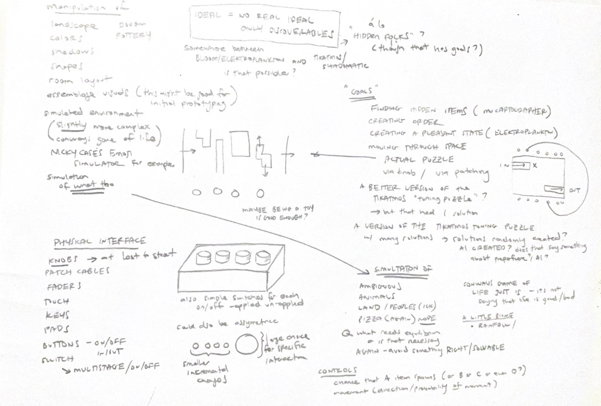

# Lest Ten Horizons Cry | Process Documentation!

## Context Statement | 09.01.23

The initial idea here is alt-control audio-based game-like interaction. Specifically, *what would a game controlled with a synthesizer look like?* 

The audio-component of this could be either
	a) an actual modular synthesizer that is used to control a visual element, or
	b) a simulated synth-like interface that controls computer-based sound and visuals

Either could be a good direction, but currently I am leaning toward a simulated synth because it would have a lower barrier of entry for players (i.e simpler control scheme) and could be designed for a cool physical visual aesthetic (a la [lovehulton](https://www.lovehulten.com/)) As far as the "game" element, interface-only is always a favorite here as is  "environmental"-sim (can we consider a [pizza pie](https://github.com/mouseandthebillionaire/purrrfectPizza) an environment? I think so) but both that and the audio/physical aspects will shake out in the ideation phase.

Obviously this builds on previous work (especially [nY-Station](http://www.mouseandthebillionare.com/nys) and even ends up being a somewhat reverse [Furniture Music](https://github.com/Whaaat-Lab/furnitureMusic), but as I think about this are some strong precedents that are doing a lot of things that I'd like to borrow from. Specific detail on each in the [precedents](precedents.md) section, but calling out here some initial thoughts:  [lovehulton](https://www.lovehulten.com/) for physical interface (as mentioned above), [In Other Waters](https://www.fellowtraveller.games/in-other-waters) for screen-based interface, and both [Elektroplankton](https://www.nintendo.com/consumer/gameslist/manuals/DS_Electroplankton.pdf) and [Mu Cartographer](https://titouanm.com/mucartographer/) as more direct references (I'm leaning on Mu Cartographer a lot here in this early conception)

That's where we stand now!

Next Steps:
	Ideation
	[Precedent Study!](Precedents.md)

PS - *Lest Ten Horizons Cry* - is just anagram of "Synthesizer Controller"

Too many secrets!

Let's go!

## Ideation | 09.08.23

While the basic idea is “game controlled by synthesizer” there are a few design values that I would like to establish right off the bat
	* elegant simplicity - in the physical object, visual representation, and music
	* discoverable states instead of one "right" state
	* reflective ambiguity

So, with that in mind, I went into the ideation phase, thinking through what this might look like. The first thing to hash out was (as mentioned above) is it going to be an actual synthesizer that control a visual simulation or  a simulated synth-like interface that controls computer-based sound and visuals (a la [nY-Station](Precedents.md/##nyStation)) I think the most interest direction for me is the latter. With that approach I will be able to build an aesthetically pleasing physical object that isn't to daunting for the player, and I will have tighter control over the sounds being made. It's *slightly* more work on the audio end, but I think it's worth it.

My second major idea hurdle here is what will the visuals look like. I really want this to be a robust simulation-type thing (as mentioned when discussing the precedent of [Nicky Case's Emoji Simulator(Precedents.md/##Nicky Case's Emoji Simulator)]), but while ideating it becomes clear that there is just too much complexity to deal with here. Also, it somewhat goes against the design value of simplicity, which is important.

I think the [Shadowmatic](Precedents.md/##Shadowmatic) reference is informative here. As mentioned in the precedents study, the real takeaway is I want to avoid this idea of "right" and "wrong" states (especially when it comes to audio). The sounds should be pleasing no matter what the user has done, but there should still be some sort of ideal "state." The solution for [Tikatmos](Precedents.md##Tikatmos), where the system randomly chose values that the user is trying to locate, is a good place to start. However, there should be some slight increase in complexity and beauty. "A better implementation of the TIKATMOS tuner minigame" still stands. 

So, the idea is this at this moment: 
	* a physical handmade synth controller with some number of control inputs (to be ideated and refined later)
	* audio is manipulated in pleasing ways as those control inputs are manipulated
	* a visual element (separate screen? embedded screen? faked LoveHulten-style visualizer thing?) is updated along with the music. Each knob controls an aspect of the abstract imagery (which could be images, colors, shapes, generative lines/objects, text, digital-effects, etc)
	* at some point a "desirable state" is reached and something happens (tone, koan, etc)

I like the ambiguity here, especially with the idea of letting the system decide where these "desirable states" should be. It starts to bring up questions about computer-control and the things we let computers do for us, the agency that we give up. Feels like an interesting place to be, as far as causing the player to reflect. The textual output itself could enforce this. 

Next steps:
	Ideation on physical interface
	Mockups of visual interface
	

