# Lest Ten Horizons Cry | Process Documentation!

## Context Statement | 09.01.23

The initial idea here is alt-control audio-based game-like interaction. Specifically, *what would a game controlled with a synthesizer look like?* 

The audio-component of this could be either
- an actual modular synthesizer that is used to control a visual element, or
- a simulated synth-like interface that controls computer-based sound and visuals

Either could be a good direction, but currently I am leaning toward a simulated synth because it would have a lower barrier of entry for players (i.e simpler control scheme) and could be designed for a cool physical visual aesthetic (a la [lovehulton](https://www.lovehulten.com/)) As far as the "game" element, interface-only is always a favorite here as is  "environmental"-sim (can we consider a [pizza pie](https://github.com/mouseandthebillionaire/purrrfectPizza) an environment? I think so) but both that and the audio/physical aspects will shake out in the ideation phase.

Obviously this builds on previous work (especially [nY-Station](http://www.mouseandthebillionare.com/nys) and even ends up being a somewhat reverse [Furniture Music](https://github.com/Whaaat-Lab/furnitureMusic), but as I think about this are some strong precedents that are doing a lot of things that I'd like to borrow from. Specific detail on each in the [precedents](precedents.md) section, but calling out here some initial thoughts:  [lovehulton](https://www.lovehulten.com/) for physical interface (as mentioned above), [In Other Waters](https://www.fellowtraveller.games/in-other-waters) for screen-based interface, and both [Elektroplankton](https://www.nintendo.com/consumer/gameslist/manuals/DS_Electroplankton.pdf) and [Mu Cartographer](https://titouanm.com/mucartographer/) as more direct references (I'm leaning on Mu Cartographer a lot here in this early conception)

That's where we stand now!

Next Steps:
- Ideation
- [Precedent Study!](Precedents.md)

PS - *Lest Ten Horizons Cry* - is just anagram of "Synthesizer Controller"

Too many secrets!

Let's go!

## Ideation | 09.08.23

While the basic idea is “game controlled by synthesizer” there are a few design values that I would like to establish right off the bat
- elegant simplicity - in the physical object, visual representation, and music
- discoverable states instead of one "right" state
- reflective ambiguity

So, with that in mind, I went into the ideation phase, thinking through what this might look like. The first thing to hash out was (as mentioned above) is it going to be an actual synthesizer that control a visual simulation or  a simulated synth-like interface that controls computer-based sound and visuals (a la [nY-Station](Precedents.md/##nyStation)) I think the most interest direction for me is the latter. With that approach I will be able to build an aesthetically pleasing physical object that isn't to daunting for the player, and I will have tighter control over the sounds being made. It's *slightly* more work on the audio end, but I think it's worth it.

My second major idea hurdle here is what will the visuals look like. I really want this to be a robust simulation-type thing (as mentioned when discussing the precedent of [Nicky Case's Emoji Simulator(Precedents.md/##Nicky Case's Emoji Simulator)]), but while ideating it becomes clear that there is just too much complexity to deal with here. Also, it somewhat goes against the design value of simplicity, which is important.

I think the [Shadowmatic](Precedents.md/##Shadowmatic) reference is informative here. As mentioned in the precedents study, the real takeaway is I want to avoid this idea of "right" and "wrong" states (especially when it comes to audio). The sounds should be pleasing no matter what the user has done, but there should still be some sort of ideal "state." The solution for [Tikatmos](Precedents.md##Tikatmos), where the system randomly chose values that the user is trying to locate, is a good place to start. However, there should be some slight increase in complexity and beauty. "A better implementation of the TIKATMOS tuner minigame" still stands. 

So, the idea is this at this moment: 
- a physical handmade synth controller with some number of control inputs (to be ideated and refined later)
- audio is manipulated in pleasing ways as those control inputs are manipulated
- a visual element (separate screen? embedded screen? faked LoveHulten-style visualizer thing?) is updated along with the music. Each knob controls an aspect of the abstract imagery (which could be images, colors, shapes, generative lines/objects, text, digital-effects, etc)
- at some point a "desirable state" is reached and something happens (tone, koan, etc)

I like the ambiguity here, especially with the idea of letting the system decide where these "desirable states" should be. It starts to bring up questions about computer-control and the things we let computers do for us, the agency that we give up. Feels like an interesting place to be, as far as causing the player to reflect. The textual output itself could enforce this. 

Next steps:
- Ideation on physical interface
- Mockups of visual interface

## Screen Interface Mocks

The starting inspiration here is bearwarp's [Glass Codex](https://bearwarp.com/#/glass-codecs/). I like the image-manipulation, post-processing, hand-written material vibe. Not sure if that will fit with the eventual aesthetics that the interface lends itself to (especially the more organic hand-written stuff), but it's a place to start.

Here is an exploration using the [lunar landscape](https://assetstore.unity.com/packages/3d/environments/landscapes/lunar-landscape-3d-132614) asset from Glitch Squirrel, tweaking the variables beyond recognition of an actual landscape and applying color changes. This isn't quite as "vaporwave" as it could be, but there's something interesting here. More direct control of the "mountain" heights would be fun, but also that is dipping even more directly into the Mu Cartographer vibe, so probably good to take a step away from that. 

Here's a somewhat successful imagining of what an "align the photos" experience could look like. Probably too on the nose, but it's sort of visually interesting. Want to see more 2D interfacey controls on the screen maybe? (but again, is that too similar to Mu Cartographer? Hoe your own row!)

Dipping into that organic Glass Codex experience here. I wonder how that handwriting would feel if everything else was even more digital? I think that some kind of text/koan displayed on the screen when a desired state is reached is a good first step in this.

note: listening to Yu Su's [Yellow River Blue](https://yusu.bandcamp.com/album/yellow-river-blue) while working on these, and immediately taking some inspiration from Touch-Me-Not. Can already imagine how a song like that would work well in this context.

## Audio Experiments | 09.21.23

[Experiment #01](https://soundcloud.com/thebillionaire/lthc-01)

This first track is an experiment in doing the synthesis purely with an external synth, specifically here the Make Noise [0-Coast](https://www.makenoisemusic.com/synthesizers/ohcoast)

Ableton is sending a single C-note every bar randomly switching to a 4-beat G-not 5% of the time. The slope is being used to create a second tone whose pitch can be lowered/raised with the "rise" knob. The on-board tap-tempo is triggering the multiply (via clk), the depth of which is being adjusted by the "multiply" knob and it's accompanying attenuator. Finally the "overtone" knob can be manipulated to affect the overall tonal quality of the sounds. 

Thus with only 4 knobs we can get a huge amount of variety in our sound creation. The most interesting thing that I want to note here is that I realized how crucial it is to have these knobs affect the sounds slowly (i.e a big turn of the knob would sound bad, and we shouldn't let the user do that) This alone is an argument for not relying on an external synth for sound creation for this project. Or, at the very least, for not letting he user have direct access to the knobs on the external synth. There could be an intermediary controller that is slowly affecting the standalone synth though, which is an interesting idea. Also, as always, it is possible to be letting Max and or Ableton be in charge of the sound-generation. 

[Experiment #02](https://soundcloud.com/thebillionaire/lthc-experiment-02)

I recorded this experiment just to prove that it would be terrible to let the user have full range control of large changes, and what do you know. It doesn't sound _that_ bad. I mean, it doesn't sound *great* but also. Kind of weird and cool?

[Experiment #03](https://soundcloud.com/thebillionaire/lthc-exploration-03)

Here we have a version with Ableton Live using the MPE Sine Pressure sound. Twiddling some knobs. Trying it out. A few of these other instruments had settings that were either a) too sweeping in their changes or b) not nearly enough. This one seems like a good middle ground. Some of the adjustments work better than others, and obviously it would be in the actual build to decide which knobs affect which parameters.

## Knob Study | 09.24.23

A lot of ways to go here. Obviously there is the "basic modular synthesizer knob" (see 0-Coast, above), but there's a little variety even there. You can buy [replacement Make Noise knobs](https://eu.elevatorsound.com/product/make-noise-replacement-eurorack-knobs-large-white-x-5-pack/), so that's an interesting option. Though looking at these, they read sooo vanilla. Like just your basic music-nerd knob. 

this reddit user's custom wooden knobs are kinda fun, but also a little too "steampunk wink wink nudge nudge get it" for me.

Looking at Love Hulten's synths again, I'm wondering what kind of knobs he is using. They look fairly standard, but are all in highly specific colours. Probably 3D printed?

Lots of knobs available at [amplified parts](https://www.amplifiedparts.com/products/synth-eurorack-parts-diy?filters=2983a3009c2982a2983) (inlcluding a bunch of coloured ones, which might be where Love Hulten is getting them after all?)

The question then is also, what kind of input are we getting from the knobs? Probably a 1-100 situation, but we could also try using a constantly spinning rotary encoder style thing ([these](https://www.sparkfun.com/products/15141) are the ones we used for TIKATMOS, which also have a push-button) though I'm not sure how that would actually work with the synth-control mapping. Though on the other other hand, you could use the rotary encoder to make those large sweeping changes apply much more granularly...

## A Narrative Emerges |  09.26.23

Come with me on a journey for a minute. 

So, in thinking about the visuals for this thing, I asked myself "what would [Z](https://github.com/zspacesheikh) do?" and started thinking about using Procreate to work on sketches. Much of this project makes me think of TIKATMOS obviously, and this idea of tuning into some distant culture is compelling. You are searching about for radio waves and get glimpses of what these beings are interested in, snapshots of art, disjointed photographic imagery, snippets of songs, etc. (this also functions similarly to In Other Waters)

But, I began thinking (especially when considering what audio snippets could be used) that this also functions a lot like memory. We have these flashes of imagery, sounds, etc that tell a hazy story of some nostalgic piece of our lives. And what if the piece could be about that? What if the entire thing is a more ambiguous auto-biographical piece about memory, nostalgia, and shared histories? In this vein I could lean on existing photograph/audio/home-movies and the wealth of recorded music from myself, friends, family, etc.

So, as it stands with this idea:
- You use two larger etch-a-sketch style knobs to tune into a pre-determined portion of the screen
- This moves around a visual marker in 2D or 3D space and also manipulates a simple synthesized instrument (via pitch, LFO, filtering, etc) until you reach the desired location
- At this point you can "lock in" to the location and begin manipulating a series of 0-127 knobs that bring in photographic, found sound, sketched, and filmic elements as well as added musical elements from a remixed song.
- the user has control over the "preferred sounds" of this. There remains no "right" way of this sounding, but the elements can be brought in or discarded until it sounds pleasant to them
- There could additionally be a randomized semi-"ordeal" location that releases a special koan/phrase/snippet etc (or a few of these locations)

## Example Audio | 09.29.23

[Song Discover Experience Experiment 01 - Janine](https://soundcloud.com/thebillionaire/lest-ten-horizons-cry-janine)

Over the last few days I have worked up an example of what this audio artifact "uncovering" could sound like. The main synth is manipulated in such a way to get a desired overtone frequency, specific beating LFO rhythm, and ideal pitch. I would assume that this same instrument would connect all of these songs together, and the next test would be to use it on a second song to see if this is possible. The song uncovered here is a tweaked (beat-repeat, ping-pong delay, etc) version of Tricerapop's [Janine](https://tricerapop.bandcamp.com/track/janine). Rock n roll. 

## Illustration Exploration | 10.01.23

Building off of the choice to use Tricerapop, here is a photo from the same time period. I like the use of charcoals in Procreate here to get that "foggy hazy memory" type vibe. In this export were are cycling through 3 different brush types, but I think it would be more effective if the brush was the same for each version of the sketch. 

For following iterations, explore:
- slowly fading in and out the different layers rather than cycling (using the default export layers option from Procreate is quick and easy here, but not quite right)
- having the placement of the layers (and size? opacity?) be manipulated by the "knobs" and/or sonic control

## RNBO Setup | 10.05.23

I don't even want to get into all the ups and downs (and smashing my head on the table) it took to get this set up, but I will because it's all part of the job.

So. [RNBO](https://rnbo.cycling74.com/) is great because it makes exportable versions of Max/MSP patches so we can do weird audio/synth/effects-processing, and that's awesome. And there's this [package](https://github.com/Cycling74/rnbo.unity.audioplugin/tree/main) that can turn the exported C++ code into a Unity plugin, but no matter how many times I built, exported, imported, and tweaked the settings... nothing. A coupla dozen times. Easily. Smash. Smash. Smursh. Smusch.

It turns out that you need to do [this](https://github.com/Cycling74/rnbo.unity.audioplugin/blob/main/docs/BUFFERS.md) in Unity to load any file dependencies that you reference in the buffer~ object. So all of you RNBO + Unity folks who found this via some very specific search terms, just do that! 

Other notes:
- GV had suggested using playlist~ for audio clip control, but that isn't supported in RNBO
- It feels stupid to set all this up in RNBO (basically recreating what Unity's audio already does) but exploring the parameters in the patching environment will hopefully yield some more interesting results
- May have to deal with multi-buffer, and that's a whole 'nother can of worms
- It's ND's birthday today! He's 1/2 of Tricerapop! It's fitting! Happy birthday, ND! Enjoy some Bob Dylan for me. 

## Second Track

The process of making that first track was so fun that I immediately made another one (though one track is probably sufficient for this stage of the project?)

[Song Discovery Experience Experiment 02 - Day's Never Say Die](https://soundcloud.com/thebillionaire/daysneverdie)

This iteration uses The Red West's [Day's Die](https://www.youtube.com/watch?v=4S4qVEqXwsE) (again with a heavy ping-pong delay) and an overlay of tons of sounds. Filtering the sounds helps to reveal that song, but again it remains fairy obfuscated from the various effects.

At this point I should probably stop making tracks (or at least not prioritizing that) and move on to the actual implementation. Next is to get them into Unity with RNBO and start seeing how an effects chain in there might work/sound.

## RNBO Synth Integration | 10.25.23

Started out this iteration by implementing the simple synth from the Max [RNBO Synth Building Blocks](https://rnbo.cycling74.com/explore/synth-building-blocks-intro). There's a lot of great stuff in here, and I have started bringing these other effects (filtering, delay) into the main RNBO patch.

Listening to various albums while working has made me want to make this foundational part of the experience a little deeper. The simple rhythmic drone is good, but perhaps is a bit too boring for that initial engagement. Probably something to add in during a later stage, but below are some musical reference points for when that happens. 

- [Light Will Never Leave - Orchid Mantis](https://orchid-mantis.bandcamp.com/track/light-will-never-leave)
- [Ornamental Plants - Ki Oni](https://kioni.bandcamp.com/track/ornamental-plants)
- [Speak Again - Jason Calhoun](https://napsounds.bandcamp.com/track/speak-again)

Also listening to [Fuck Buttons' Ribs Out](https://www.youtube.com/watch?v=qgJk4qx_Ofk) again this week brings to mind a possible track for this experience that is all jangly syncopated percussion. Always new fun things to try!

## RNBO Instrument Effect Chain + Unity Mixer Stack | 11.08.23

Yes! This is the way to go (or at least arises as something that I can wrap my mind around a bit better)

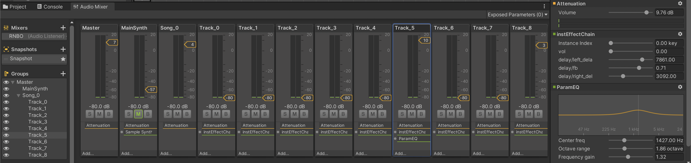

This iteration uses RNBO <em>only</em> to handle the effects chain of each individual track. Then the Unity mixer is responsible for the volume control for each track. This makes a whole lot more sense, and paves the way  to easily swap in/out the songs via code later, which will make the project more extendable. 

Next:
- Build a visual interface in the screen that shows where the dials are currently set
- Program a 'dial/knob' script/object
- Add more effects to the RNBO plugin (notably distortion/bit-crushing which is awful in Unity)

## Days Never Say Die Implementation | 11.16.23

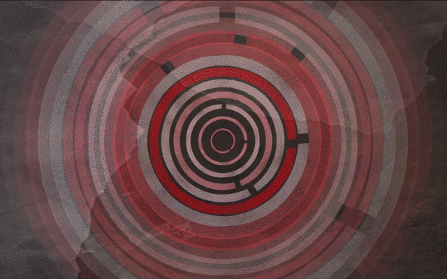

So we finally have a legitimate implementation of a song. The current use of the RNBO effect works really well. There's only one effect in the chain at present, but it is really easy to target both the parameters within this RNBO effect as well as any standard unity mixer parameters. Excellent.

Building all of this shows how fiddly and hands-on the tweaking of these parameter variables is going to be, and so it is good that we have set up a way to easily do this in the inspector. From here, to really fine-tune the experience is going to be a fairly laborious process, but this is probably fine. There could maybe be a way to randomize this, but the human/artist touch will serve the work more.

Additionally, this build brings up the issue of parameter control in general. Right now we have six knobs controlling eighteen parameters, which..
- gives us a lot parameters and
- some parameters are chained to each other, which is interesting, 
but...
- the hard-coding of the parameters feels to constricting
- might there be a more exploratory way for this?

It's something to explore further, but it worth noting that every level of abstraction/exploration/novelty adds the possibility of making it harder for the user to understand what is going on (as it is, L is already confused to what is going on just by looking at the video version of the gif above).

Side note that isn't mentioned elsewhere: this week's experimentation proved that it is possible to extend the computer screen to an iPad through universal control. This is going to make the installation so much easier!

Also, knobs/dials and other misc hardware has been ordered from Adafruit (which, for the record, doesn't have outrageous fees to ship to Canada!) so hardware build can commence after next week's inspirational sojourn to the Liberty Bell.

Next:
- build a role version of the experience that moves from synth tuning/exploration to "finding" this particular track
- Spend the hours tweaking this song's parameters for a more compelling sonic experience
- add the additional effects to the RNBO effect object (distortion, specifically)

## Hardware Hustle | 12.08.23

The past two weeks has been filled with the tedious, frustrating, and boring activity of building out and testing the hardware aspects of the project. I always seem to forget how un-friendly all of these electronic components are with each other, and how annoying it can be to get everyone playing nicely. For instance:

These [I2C QT Rotary Encoder Breakout Boards from Adafruit](https://learn.adafruit.com/adafruit-i2c-qt-rotary-encoder/overview) seem great right? That's going to make everything waaay easier. 

Ordered. Wait. Shipped. Wait. They're here! Yay! Let's go.

All we have to do is go to campus and solder these babies up! Hold up. There are multiple children stuck at my house because of teacher strikes. This is going to make commuting more difficult...

Okay. Soldering iron ordered. Wait. Shipped. Wait. Okay. Let's do this!

Wait, you need to connect the rotary endoers to a microcontroller via the SDA SCL? Did you know that the original Arduino Diecimilia (which there are 5 of sitting around here) doesn't have that? I didn't either, but now I do! 

That's cool. There's also an UNO in this bin that we can use, but it doesn't work for some reason. Should be fine? Wait, it's made by [Vilros](https://vilros.com/collections/arduino)? But I always drink plenty of [malk?](https://www.youtube.com/watch?v=ovfM7dvFto0)

Okay, new <em>official</em> Arduino UNO R3 ordered. Wait. Shipped. Wait. It's here. Let's go!

Okay, everything seems to be working on the Arduino side. All we need to do is use the Arduino keyboard library to easily communicate with Unity (like we've *always* done for projects like these). 

Wait. The UNO R3 *doesn't* support the keyboard library, but the R4 DOES!?!?

Anyway, we can still use the serial communication so it will be fine, just a little bit more work; what a boring story! But the realization that this part of the process is so prone to being destroyed by these small issues is really interesting. When teaching students, we always recommend at least a month buffer for these kinds of issues, and this just goes to show that it's not for no reason! Even with the large number of technically similar projects that I've made, these issues still arise. There are unexpected failures. The pieces don't always fit. And it seems like this is more the rule than the exception. Something to be aware of: both for future work and when advising other people. 

Moving on!

Next (and thoughts):

- Also spent a TON of time working on the RNBO patch, and there is a bunch of fun functionality in there right now. The synth sound as implemented feels a little too rambly/funky and so refining that is a priority. 
- Once the dials are all working appropriately in the Unity project it will be interesting to see how the 'tuning' aspect feels, but as of now it feels pretty bad? There's no visual feedback (by design) and the audio feedback is too ambiguous? And some part of the project design goals is ambiguity, but maybe this is too much? Something to test with others, as well. One thought (to also address the rambly synth mentioned above) is to add a third voice with fairly one-to-one mapping pitch/bpm/volume/etc
- Mock up some layout designs for the final form factor (acknowledging that this will probably be a temporary solution)
- Write a process post on using AudioMixer Snapshots in the synth settings, cause that business is 🔥

## New Adventures in UI | 01.10.24
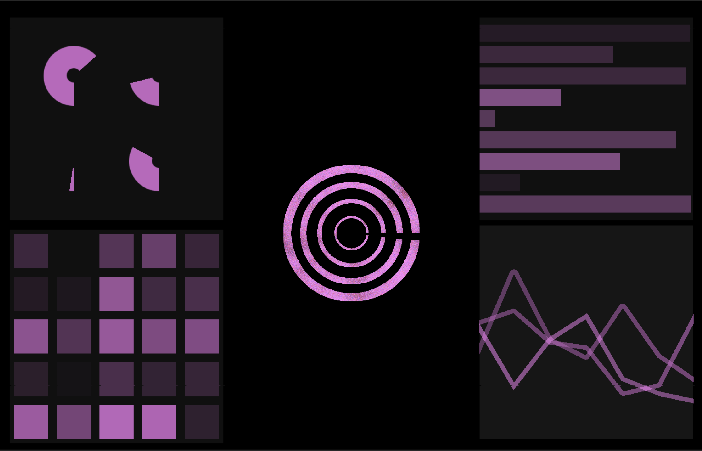

Over the weekend a new (old) idea presented itself: the concept of a secret world hidden within an otherwise confusing-yet-seemingly-traditional-interface. If we lean more heavily on the first part of the interaction as "traditional" synthesis manipulation, then the switch to the second part can be more rewarding.

So, with this new UI I am attempting to do this. Each of the quadrants is controlled by one of the four dials. And each of these dial/quadrant combos controls a *specific* aspect of the sound generation (step sequencer, synth voice, found-sound, etc) When the player has dialed into the correct "location" then the screen begins to break and glitch, hinting that there's something more here below the surface.

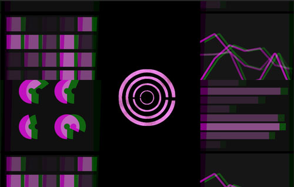

## Enclosure | 01.20.24

Enclosure is done Right now it is running within the Unity engine instead of as a standalone, but this is fine to test the interaction and make sure that it is working as expected.

One note about this prototype: The nature of the Apple ecosystem makes it possible to mirror or extend the computer screen over to an iPad. This is really convenient for testing/prototyping! This whole version is just an iPad duct tapped inside the controller. Arguably, not *that* different from when there's an external monitor running from HMDI, but way cheaper/easier to set up!
## New New Adventures in UI | 03.27.24

Back at it like a crack addict (but instead of crack it's UI elements)

The big news is that this project has been accepted as a nominee for [A Maze 2024](https://2024.amaze-berlin.de/) and so it's perfect time to completely rethink everything about it and try to make it better.

After some heavy-duty brainstorming with [DigitalRelic](https://github.com/digitalrelic/) we have mapped out some new functionality for the sonic control. The big thing of note here is that we are now going to utilize the dial-clicks to cycle through multiple parameters per quadrant. 

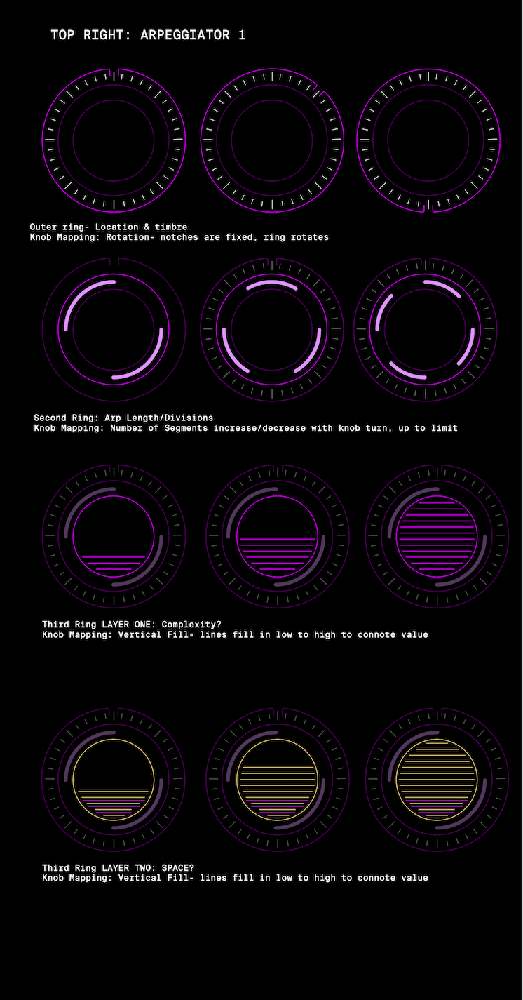

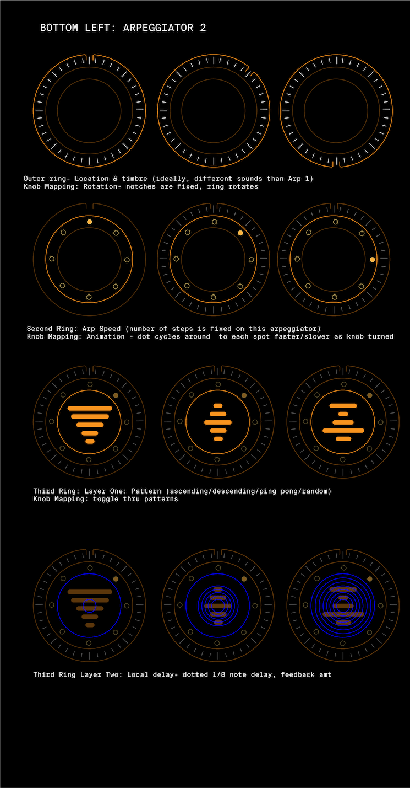

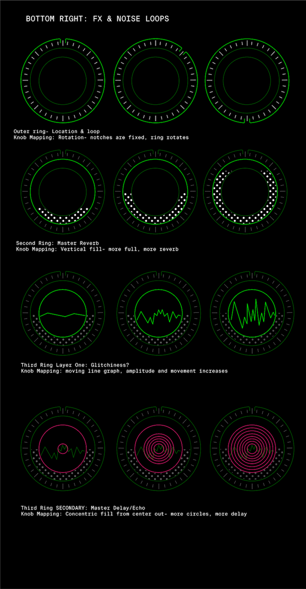

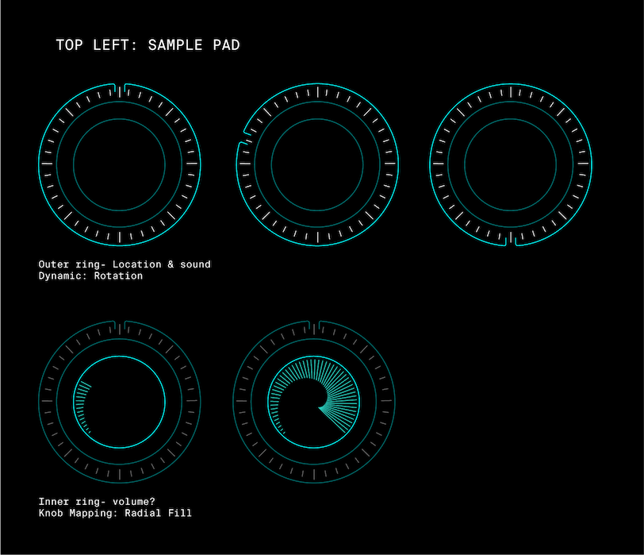

## Location Design 2.0 | 04.23.24

Some new thoughts about the ways these locations work. Where the "synth" section of the experience should feel deliberate, specific, thoughtful, etc the goal for these sections is performative, loose, emotional, etc. So, the effects are more immediate (both visually and sonically) Twist a dial and the screen warps/distorts/rotates and heavy delay/distortion/filtering is applied.

We are using the [Limitless Glitch Effect](https://assetstore.unity.com/packages/vfx/shaders/fullscreen-camera-effects/limitless-glitch-effects-148376) pack from the Unity Asset store, which works pretty well here. A little finagling to get it to do exactly what we want, but allows for some fun combinations.

Also of note is that this section also has a built in progression. Each location song has 7-8 stages and the player is able to work through them as they turn the dials. All we're looking at as far as input here is dial-turns: every time the dial is turned a counter goes up, and as soon as we've hit a certain threshold we advance. Easy peasy.
## New Enclosure(s) | 05.01.24

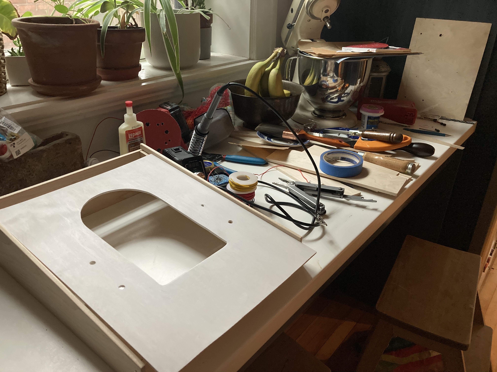

New enclosure is almost done. We have switched to a vertical layout with the rounded top for some visual interest. For A Maze we will have two specially built versions, one black and one white, just because that seemed fun. I'm slightly curious if it diminished the experience by having more than one of the devices available, but it's probably worth it so that more people can use it at once. We will also have headphone apps so that two players can listen in at the same time.
## Image Treatment | 05.02.24

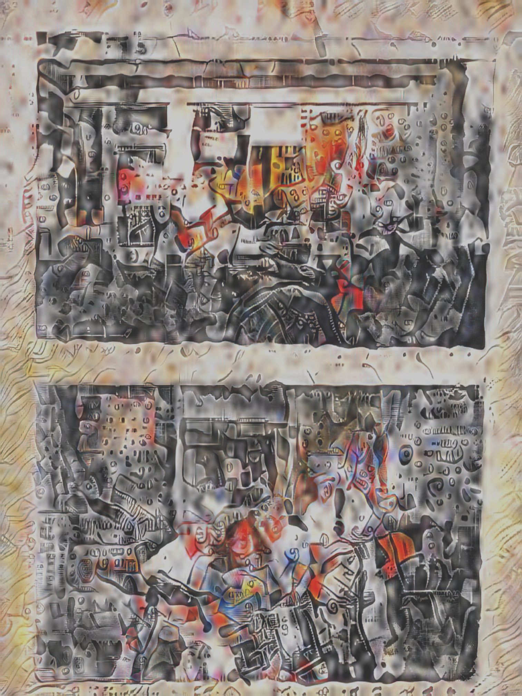

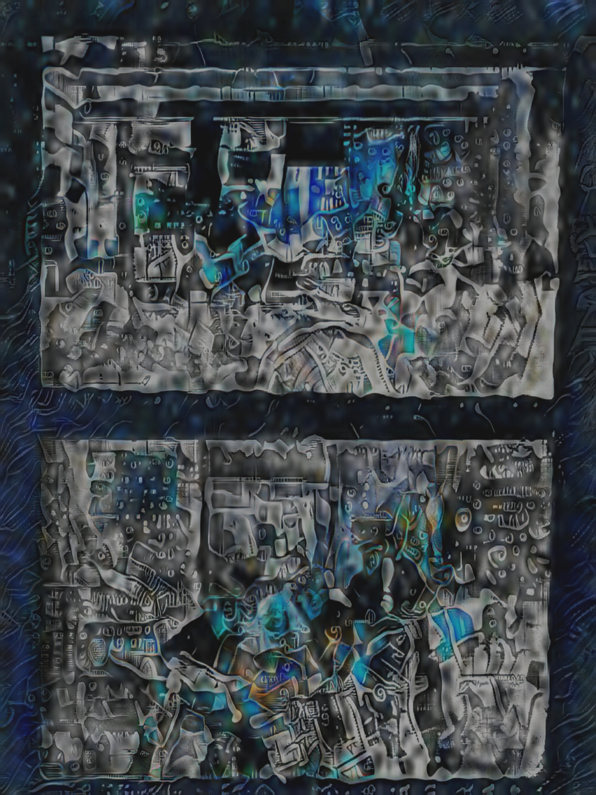

Thinking through the images used in the locations. I want them to be autobiographical, but I also don't really want to use actual personal images. The whole thing should be obfuscated and obscure. So, to accomplish this, I have scanned hundreds of images from my own personal photo albums but then run them through Photoshop's Style Transfer Neural filter. (For the record, the above images are from High School so I fed in some trapper-keeper style collage I found online as an initial image reference, but I can't find it now)

I like this idea of having a machine try to make sense of the images. It fits in thematically that the machine is an actual barrier between the artist and the audience. Also, this idea of the object being some sort of meaning-making device for future audiences to make sense of a reality that has long been forgotten. As it stands now, it's slightly clunky, but there's something here to keep thinking about.
## A MAZE. Berlin | 05.13.24

Whelp. Over the last week we finally got to showcase this thing as one of the nominated games at [A MAZE./ Berlin](https://2024.amaze-berlin.de/). It was truly a phenomenal time, and so many people spent thoughtful time with the experience and gave us <em>plenty</em> of feedback to mull over.

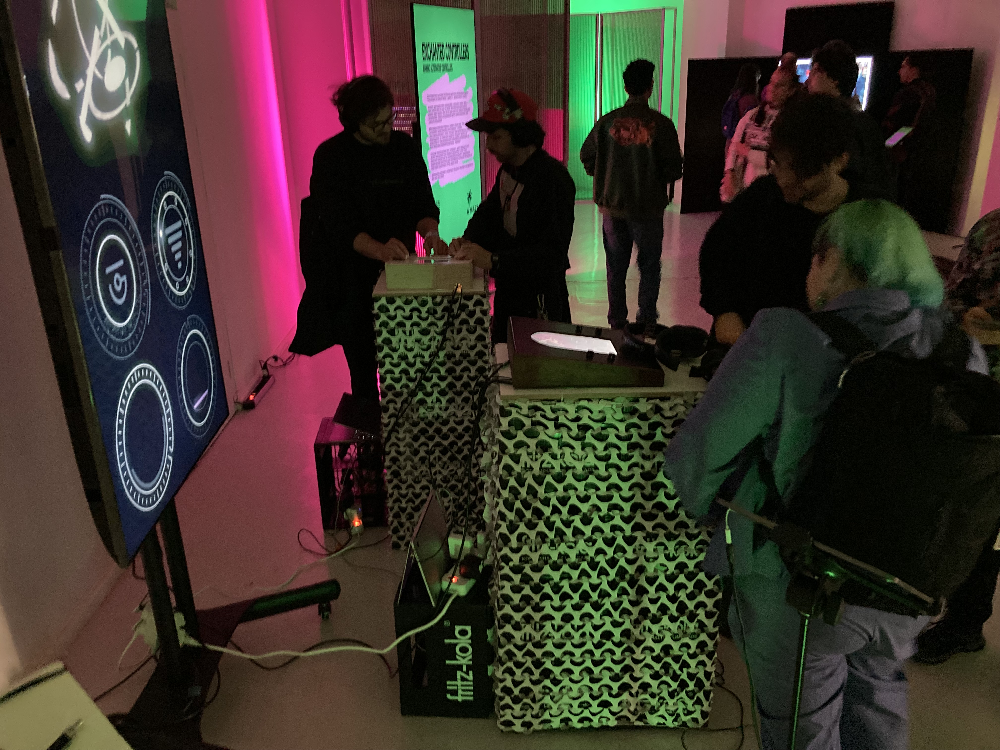
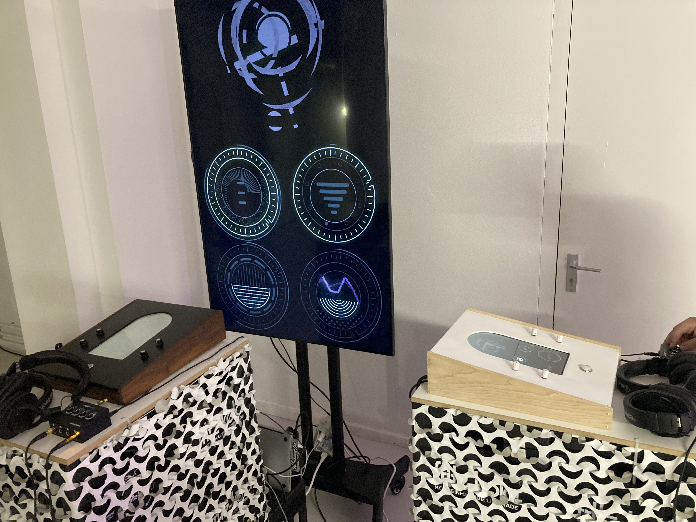

Some initial loose thoughts in regards to a) the success/failures of the experience and b) ideas for future steps and/or other projects (with perhaps more to come after we've sat with this for a bit):

- It is interesting to note how hit or miss a reflective experience can be in a festival setting. We are purposefully sharing a fairly obtuse and exploratory interaction that doesn't always prove successful. Some people would spin a knob for a few seconds, not hear enough change, and immediately walk away. Many people, however, did spend the time to deeply interact with it. Not sure if this would be true for other festivals, or if the A MAZE crowd is more well-suited to the ambiguity.
- This leads in to a question about reflective experiences in general, and what is the best venue for them. Is a person's home ideal because it is a safe/known space for them? Or is it better for it to be out in public? It makes sense that being slightly out of your comfort zone would be helpful to get into that reflective state. Think museums. Think parks. Think sacred spaces. A survey of architectural theory would probably inform this. But also helping that frame-shifting to happen in a space that you are familiar could be impactful.
- Extending from that question, what could the possible format of this be based on those locations? Is it better to do something phone/web based so that people are getting new and unexpected experiences on their phones? Is it better to have the thing set up in a gallery-like space? Maybe so if it is off to the side and allows for the length of time needed to fully engage with it
- What other hinderance/aides are there to allow people to fully engage? The headphones clearly helped, I think, but perhaps standing did not? Would it be better to require sitting? Does being in the middle of the floor hurt it? Too exposed? Not the participants are doing anything too potentially embarrassing, but still.
- Technologically wise, we definitely see the need for a more robust enclosed system. Firstly, it allows the thing to be turned on and off without us standing there (which I only realized on the last day *could* have been done with a separate user account) But secondly, allows for the computing/hardware aspects to be more secure. It also allows for a thing to be shipped if necessary? Which would then mean it could be at more festivals? But, then again, maybe it's asking too much for an abstract/obtuse sound-game to be running without someone there to give context. Either way, there's some ideas as to how this could happen. Mini PCs. Raspberry Pis running web builds. Exporting from some other engine.
- Finally, I definitely want to do another project that builds on this. Not this. I think this is done, but something that *nexts* this idea. That keep poking at the question of granular audio control, reflective experiences, and abstract "puzzly" bits.

